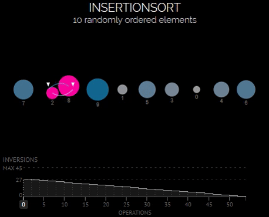

# Вопросы

1. Оценка сложности алгоритма по времени

  А всё

2. Оценка сложности алгоритма по памяти

3. Сортировка вставками

  
<h1> Сортировка вставками </h1>

  <h2> Асимптотика по времени </h2>
  <h3>

| Оценка     | Лучший случай | Средний случай | Худший случай |
|:----------:|:-------------:|:--------------:|:-------------:|
| По времени | O(n)          | O(n^2)         | O(n^2)        |
| По памяти  | O(1)          | O(1)           | O(1)          |

  Лучший случай достигается, при изначально отсортрованном массиве.
  
  Инвариант: на j-й итерации цикла массив [0..(j-1)] состоит из исходных элементов, расположенных в порядке возрастания.

  На первой итерации алгоритм состоит из 1 исходного элемента, расположенного по возрастанию.

  <h3>    
  

4. Сортировка слиянием

5. Быстрая сортировка

6. Сортировка подсчетом

7. Цифровая сортировка

8. Стек

9. Очередь

10. Односвязный список

11. Двусвязный список

12. Циклический список

13. Стек на списках

14. Очередь на списках

