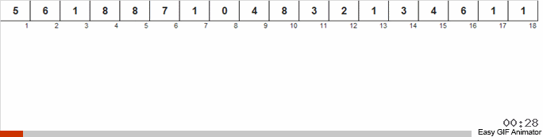

# Вопросы
<details><summary>1. Оценка сложности алгоритма по времени </summary>
<center><h1> Оценка сложности по времени </h1></center>
<br><h2> Оценка сложности алгоритма </h2><br>

<h3>

**(a)** **O(g(n))** — *верхняя оценка* сложности алгоритма. Запись **T(n) = O(g(n))** означает, что существуют **C > 0, N > 0** такие, что для любого **n >= N** будет выполняться **0 <= T(n) <= C·g(n)**.

**(b)** **Ω(g(n))** — *нижняя оценка* сложности алгоритма. Запись **T(n) = Ω(g(n))** означает, что существуют **C > 0, N > 0** такие, что для любого **n >= N** будет выполняться **0 <= C·g(n) <= T(n)**. Можно сказать, что **T(n) = Ω(g(n))**, если **g(n) = O(T(n))**.

**(c)** **θ(g(n))** — *точная оценка* сложности алгоритма. Запись **θ(n) = Ω(g(n))** означает, что существуют **C, K > 0, N > 0** такие, что для любого **n >= N** будет выполняться **0 <= C·g(n) <= T(n) <= K·g(n)**. *Точная оценка* сложности алгоритма будет существовать в том случае, если *верхняя* и *нижняя оценка* будут равны.

<h3>


<br><h2> Свойства О </h2><br>

<h3>

**T1(n) = O(g1(n))**, **T2(n) = O(g2(n))**

1. *Сложность суммы*: **T1 + T2 = O(max(g1(n), g2(n)))**.

2. *Сложность произведения*: **T1·T2 = O(g1(n)·g2(n))**.

3. *Умножение на константу*: **C·T1 = O(g1(n))**.

4. *Сумма с константой*: **C + T1 = O(g1(n))**.

5. *Теорема о связи* **O**, **Ω**, **θ**: **T(n) = θ(g(n)) <=> T(n) = O(g(n))** и **T(n) = Ω(g(n))**.

<h3>

<br><h2> Классификация алгоритмов </h2><br>

<h3>

Можно выделить следующие типы временной сложности:

1. *Постоянный*: **O(1)**

2. *Логарифмический*: **O(log(n))**

3. *Линейный*: **O(n)**.

4. *Квадратичный*: **O(n^2)**.

5. *Кубический*: **O(n^3)**.

6. *Полиноминальный*: **O(n^m)**.

7. *Экспоненциальный* **O(t^p(n))**, **t** — константа, **p(n)** — некоторая полиноминальная функция.

8. *Факториальный*: **O(n!)**. Обладает наибольшей временной сложностью среди всех известных типов.

<h3>


</details>
<details><summary>2. Оценка сложности алгоритма по памяти</summary>
То же самое, что и по времени только по памяти...
</details>
<details><summary>3. Сортировка вставками</summary>
  <center><h1> Сортировка вставками </h1></center>
  <br><h2> Асимптотика алгоритма </h2><br>
 
  <h3>

| Оценка     | Лучший случай | Средний случай | Худший случай |
|:----------:|:-------------:|:--------------:|:-------------:|
| По времени | O(n)          | O(n^2)         | O(n^2)        |
| По памяти  | O(1)          | O(1)           | O(1)          |

  Лучший случай достигается, при изначально отсортрованном массиве.
  
  Инвариант: на j-й итерации цикла массив [0..(j-1)] состоит из исходных элементов, расположенных в порядке возрастания.

  На первой итерации алгоритм состоит из 1 исходного элемента, расположенного по возрастанию.

  <h3>    
  

  <br><center><h1> Реализация </h1></center><br>

```c++
  
```

</details>
<details><summary>4. Сортировка слиянием</summary>
  <center><h1> Сортировка Слиянием </h1></center>
  <br><h2> Асимптотика алгоритма </h2><br>

  <h3>

| Оценка     | Лучший случай | Средний случай | Худший случай |
|:----------:|:-------------:|:--------------:|:-------------:|
| По времени | O(n * log(n)) | O(n * log(n))  | O(n * log(n)) |
| По памяти  | O(n)          | O(n)           | O(n)          |
  <br>По времени: n тратится на слияние log(n) на зазбиению через вызов рекурсии. 

  !Необходим дополнительный массив при слиянии.
  <h3>    
  
  <br><center><h1> Реализация </h1></center><br>

```c++
  
```
</details>
<details><summary>5. Быстрая сортировка</summary>

  <center><h1> Быстрая сортировка </h1></center>
  <br><h2> Асимптотика алгоритма </h2><br>
 
  <h3>

| Оценка     | Лучший случай | Средний случай | Худший случай |
|:----------:|:-------------:|:--------------:|:-------------:|
| По времени | O(n·log(n))   | O(n·log(n))    | O(n^2)        |
| По памяти  | O(log(n))     | O(log(n))      | O(n)          |

*Худший случай* — когда на каждом разбиении массив делится на одноэлементный массив и массив длины **n - 1**.

**log(n)** в оценке памяти — глубина рекурсии.
<h3>

<h2> Разбиение Ломуто </h2>

<h3>

*Опорный элемент* — последний элемент массива.

<h3>

<h2> Разбиение Хоара </h2>

<h3>

*Опорный элемент* — элемент посередине массива.

*Разбиение Хоара* эффективнее Ломуто, так как происходит в среднем в **3** раза меньше свапов, и разбиение эффективнее, когда все элементы равны.

<h3>

<h2> Модификации </h2>

<h3>

1.  Выбор *опорного элемента* случайным образом.

2.  Выбор *опорного элемента*, как среднее между крайным левым и крайним правым значением массива.

<h3>

<h2> Устойчивость </h2>

<h3>

*Быстрая сортировка* не является устойчивой сортировкой из-за свапов при разбиении на два массива.

<h3>


  <br><center><h1> Реализация </h1></center><br>

```c++
void QuickSort(vector<T>& a, int l, int r, Compare& cmp) {
  int i, j;
  auto k = a[l + (r - l) / 2];
  i = l;
  j = r;
  do {
      while (cmp(a[i], k)) i++;
      while (cmp(k, a[j])) j--;
      if (i <= j) {
          swap(a[i], a[j]);
          i++;
          j--;
      }
  } while (i < j);
  if (l < j) QuickSort(a, l, j, cmp);
  if (i < r) QuickSort(a, i, r, cmp);
}
```

</details>
<details><summary>6. Сортировка подсчетом</summary>

  <center><h1> Сортировка подсчетом (первая вариация) </h1></center>
  <br><h2> Асимптотика алгоритма </h2><br>
 
  <h3>

| Оценка     | Лучший случай | Средний случай | Худший случай |
|:----------:|:-------------:|:--------------:|:-------------:|
| По времени | O(k + n)      | O(k + n)       | O(k + n)      |
| По памяти  | O(k)          | O(k)           | O(k)          |

В данной реализации исходный массив **A[n]** состоит из целых чисел от **0** до **k - 1**. Массив **C[k]** для подсчета количества повторений каждого числа в массиве **A**. После этого в **A** последовательно каждый **i** записывается **C[i]** раз.

<h3>

<h2> Устойчивость </h2>

<h3>

Данная реализация сортировки подсчетом не является устойчивой, так как идет перезапись каждого элемента.

<h3>



  <br><center><h1> Реализация </h1></center><br>

```c++
void CountingSort(vector<int>& a) {
    int maxn;
    for (int i = 0; i < a.size(); ++i) {
        maxn = max(maxn, a[i]);
    }
    maxn++;
    vector<int> cnt(maxn, 0);
    for (auto el: a) {
        cnt[el]++;
    }
    a.clear();
    a.resize(0);
    for (int i = 0; i < maxn; ++i) {
        for (int j = 0; j < cnt[i]; ++j) {
            a.push_back(i);
        }
    }
}  
```

  <center><h1> Сортировка подсчетом (вторая вариация) </h1></center>
  <br><h2> Асимптотика алгоритма </h2><br>
 
  <h3>

| Оценка     | Лучший случай | Средний случай | Худший случай |
|:----------:|:-------------:|:--------------:|:-------------:|
| По времени | O(n)          | O(n)           | O(n)          |
| По памяти  | O(k + n)      | O(k + n)       | O(k + n)      |

В данной реализации мы начинаем сортировку аналогично первой вариации. Исходный массив **A[n]** состоит из целых чисел от **0** до **k - 1**. Массив **C[k]** для подсчета количества повторений каждого числа в массиве **A**. После того, как мы посчитали количество каждого **i**, мы определяем индекс последнего элемента **i** в отсортированном массиве. Создаем вспомогательный массив **B[n]** и в него, идя по **A** с конца, записываем каждый **i** по индексу из **C**. Индекс записанного только что элемента уменьшаем на **1**. (думаю на коде станет понятнее).

<h3>

<h2> Устойчивость </h2>

<h3>

Данная реализация сортировки подсчетом является устойчивой. Мы расставляем объекты с одинаковыми значениями ключа сортировки по их исходным позициям относительно друг друга.

<h3>

<h2> Модификации </h2>

<h3>

1. С помощью линейного поиска *максимума* и *минимума* находим диапазон чисел. Это не влияет на асимптотику алгоритма, так как поиск выполняется за **O(n)**.

2. *Минимум* может быть отрицательным, в то время как в **C** индексы от **0** до **k - 1**. Поэтому при работе с массивом **C** нужно вычитать *минимум* из **A[i]**, а при записи в **B[i]** прибавлять его.

<h3>

<h3> 

Единственное, что в графической реализации мы идем с начала массива **A**, это делает сортировку неустойчивой. Если мы будем идти с конца (т.е. как и описывалось), то сортировка станет устойчивой.

<h3>


  <br><center><h1> Реализация </h1></center><br>

```c++
  
```


</details>
<details><summary>7. Цифровая сортировка</summary>

  <center><h1> Цифровая сортировка </h1></center>

  <br><h2> Асимптотика алгоритма </h2><br>
 
  <h3>

| Оценка     | Лучший случай | Средний случай | Худший случай |
|:----------:|:-------------:|:--------------:|:-------------:|
| По времени | O(m·T(n))     | O(m·T(n))      | O(m·T(n))     |
| По памяти  | O(M(n))       | O(M(n))        | O(M(n))       |

**T(n)** и **M(n)** — сложности по времени и памяти сортировки, которая используется для разрядов. В конкретно этой реализации, мы используем устойчивую сортировку подсчетом. **m** — количество разрядов сортируемых элементов.

| Оценка     | Лучший случай | Средний случай | Худший случай |
|:----------:|:-------------:|:--------------:|:-------------:|
| По времени | O(m·n)        | O(m·n)         | O(m·n)        |
| По памяти  | O(m + n)      | O(m + n)       | O(m + n)      |

Алгоритм представляет собой цикл по номеру разряда, начиная с правого (младшего). На каждой итерации элементы массива **A** размещаются в нужном порядке во вспомогательном массиве **B**. Для сортировки на каждой итерации цикла по разрядам используется *устойчивая сортировка подсчетом*.

Конкретная реализация *цифровой сортировки* называется *LSD-сортировкой* — цикл идет по разрядам, начиная с младшего, то есть справа.

Существует модификация, в которой мы начинаем со старшего разряда (слева). Она называется *MSD-сортировкой*.
<h3>


  <br><center><h1> Реализация </h1></center><br>

```c++
void radixSortLSD(vector<string> &a, int m){
    for (int i = m - 1; i >= 0; i--) {
        vector<string> temp_arr;
        for (int digit = 0; digit <= 26; digit++)
            for (string& item : a){
              if (item[digit] == char(digit + 'a')) {
                temp_arr.push_back(item);
              }
            }
        a = temp_arr;
    }
}  
```

</details>
<details><summary>8. Стек</summary>
  <center><h1> Стек </h1></center>
  <br><center><h2> Оценка операций структуры по времени </h2></center><br>
  <h3>

| Удаление | Добавление | Поиск |
|:--------:|:----------:|:-----:|
|   O(1)   |    O(1)    |  O(n) |


  <br> <center> Описание структуры </center> <br>
  <p>Stack - абстрактный тип данных, представляющий собой список элементов, организованных по принципу LIFO (англ. last in — first out, «последним пришёл — первым вышел»). </p>

  <p>Если проще, то Stack можно представить в виде стопки книг (для того, чтобы добраться до определенной книги необходимо убрать сверху все остальные). </p> 

  <p>Стек состоит из ячеек(в примере — это книги), которые представлены в виде структуры, содержащей какие-либо данные и указатель типа данной структуры на следующий элемент.</p>

  <h3><br>   
  

  <br><center><h1> Реализация </h1></center><br>

```c++
  
```
  
</details>
<details><summary>9. Очередь</summary>
  <center><h1> Очередь </h1></center>
  <br><center><h2> Оценка операций структуры по времени </h2></center><br>
  <h3>

| Удаление | Добавление | Поиск |
|:--------:|:----------:|:-----:|
|   O(1)   |    O(1)    |  O(n) |
<h3>
<br> <center> Описание структуры </center> <br>

<h3>

  **Queue** — абстрактный тип данных, представляющий собой список элементов, организованных по принципу **FIFO** (англ. first in — first out, «первым пришёл — первым вышел»).

  * **head** — голова очереди (отсюда удаляются элементы).
  * **tail** — хвост очереди (сюда добавляются элементы).

  Очередь поддерживает следующие операции:

  1. **push** — операция вставки элемента (ставится в конец).
  2. **pop** — операция удаления элемента (убирается из начала).
  3. **size** — операция получения количества элементов в очереди.
  4. **empty** — проверка очереди на наличие в ней элементов.
  5. **top** — возвращает элемент из начала.

<h3>


  <br><center><h1> Реализация </h1></center><br>

```c++
  
```
</details>
<details><summary>10. Односвязный список</summary>

  <br><center><h1> Реализация </h1></center><br>

```c++
  
```

</details>
<details><summary>11. Двусвязный список</summary>

  <br><center><h1> Реализация </h1></center><br>

```c++
  
```

</details>
<details><summary>12. Циклический список</summary>

  <br><center><h1> Реализация </h1></center><br>

```c++
  
```

</details>
<details><summary>13. Стек на списках</summary>

  <br><center><h1> Реализация </h1></center><br>

```c++
  
```

</details>
<details><summary>14. Очередь на списках</summary>

  <br><center><h1> Реализация </h1></center><br>

```c++
  
```

</details>
